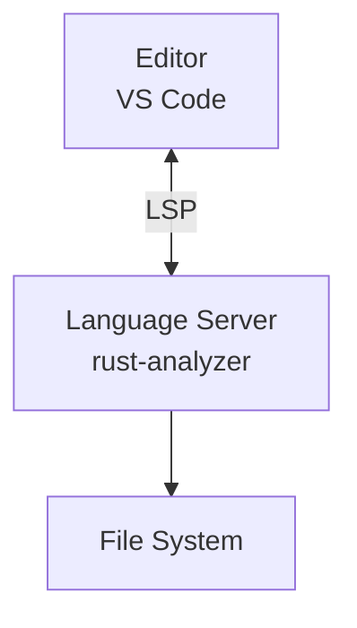
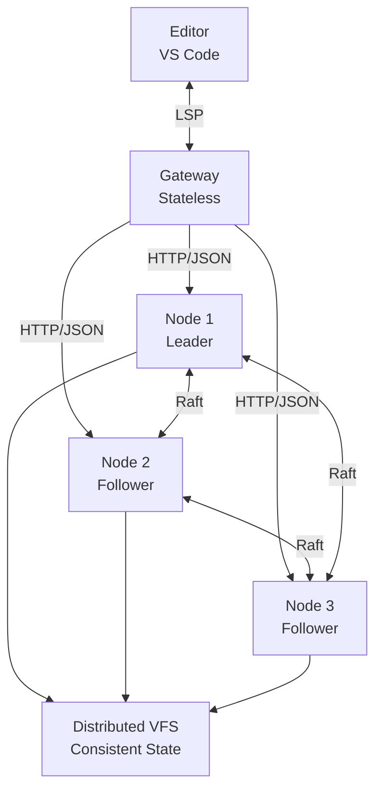
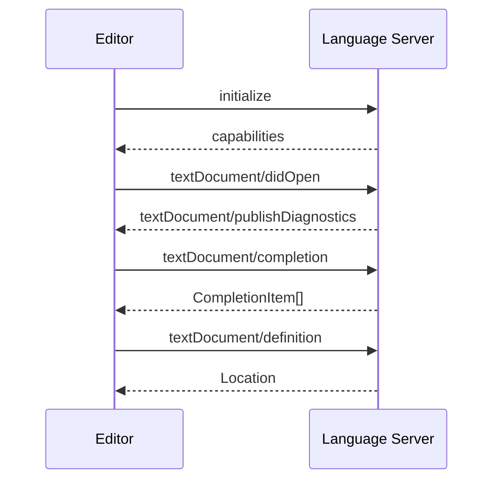
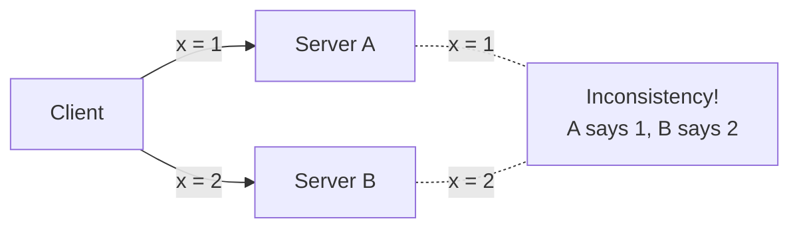
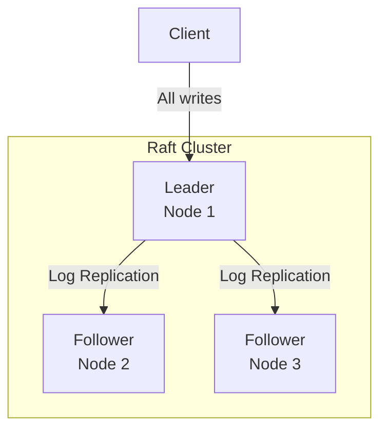
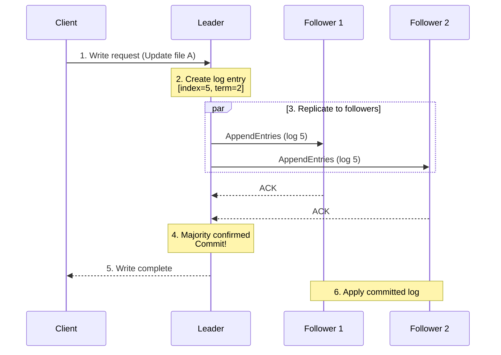
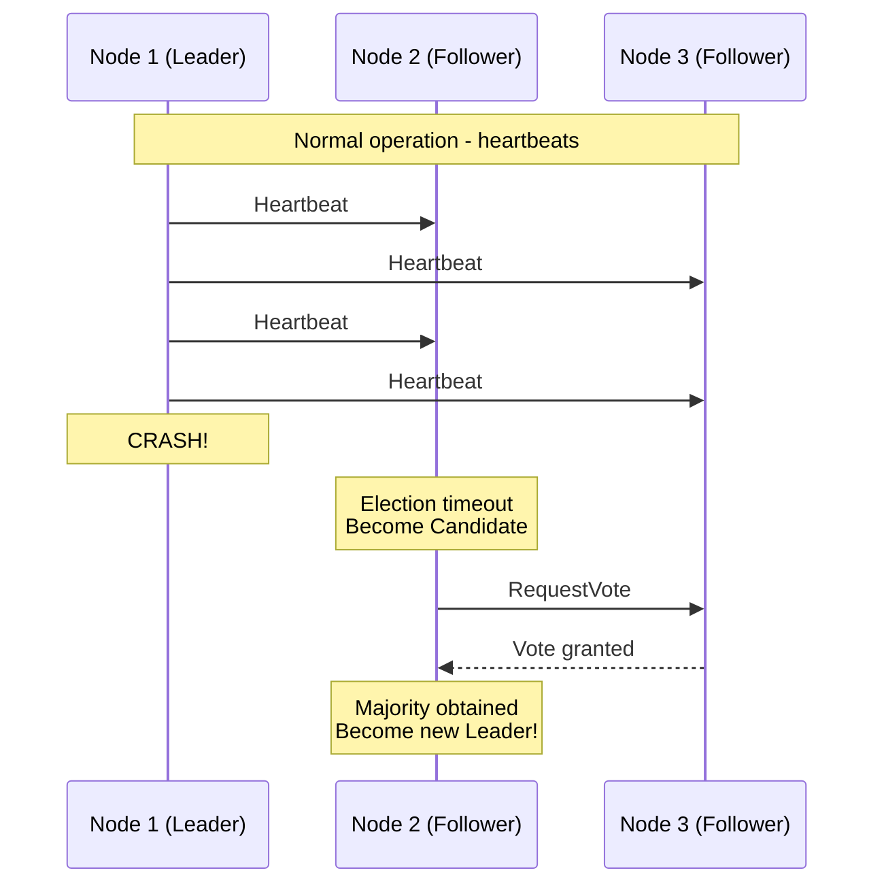
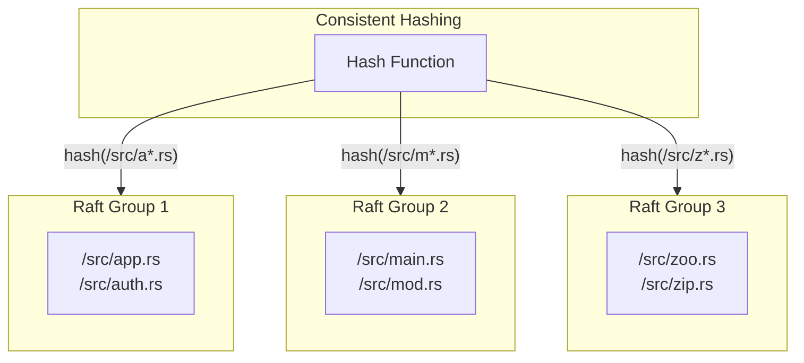
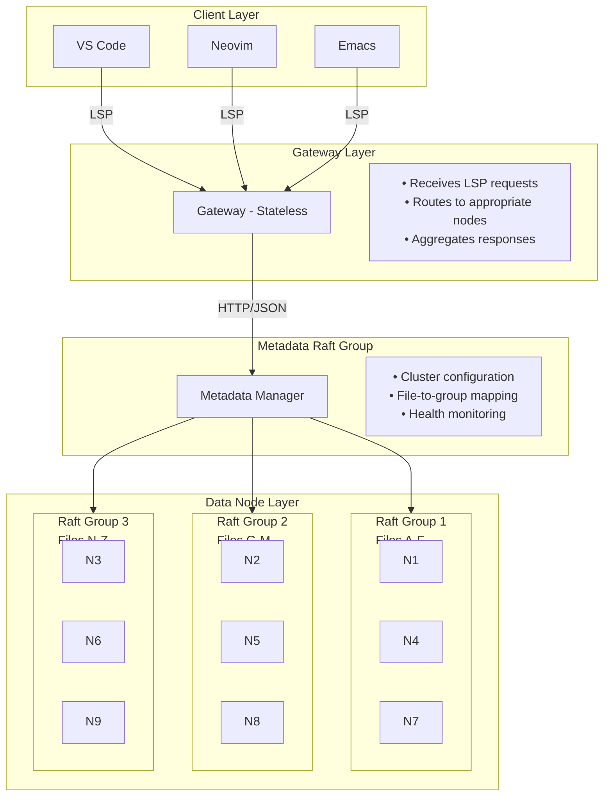

# VRaftLS

**Virtual Raft-based Language Server Cluster**

> **Warning**
> This is a highly **experimental** project and purely a **Proof of Concept (PoC)**.
> It is not intended for production use. APIs and architecture may change without notice.

---

## Table of Contents

1. [Overview](#overview)
2. [Problem This Project Aims to Solve](#problem-this-project-aims-to-solve)
3. [Key Technical Concepts](#key-technical-concepts)
   - [What is Language Server Protocol (LSP)?](#what-is-language-server-protocol-lsp)
   - [What is the Raft Consensus Algorithm?](#what-is-the-raft-consensus-algorithm)
   - [What is a Distributed File System?](#what-is-a-distributed-file-system)
4. [Architecture](#architecture)
5. [Project Structure](#project-structure)
6. [Build and Run](#build-and-run)
7. [Glossary](#glossary)
8. [References](#references)

---

## Overview

VRaftLS is an experimental project to realize a **Language Server that operates cooperatively across multiple servers**.

Typically, editors like VS Code or Neovim communicate one-to-one with a single Language Server process (e.g., rust-analyzer). VRaftLS distributes this Language Server across multiple nodes (servers) and synchronizes state using the **Raft consensus algorithm**, aiming to achieve:

- **Horizontal Scaling**: Distribute processing of large codebases across multiple nodes
- **Fault Tolerance**: Continue operating even if some nodes fail
- **Consistency**: Return the same results regardless of which node is accessed

---

## Problem This Project Aims to Solve

### Current Challenges



**Problems:**
1. **Single Point of Failure**: All functionality stops if the Language Server crashes
2. **Scalability Limits**: A single process cannot handle massive monorepos
3. **Resource Constraints**: Limited by the memory and CPU of a single machine

### VRaftLS Solution



**Benefits:**
1. **High Availability**: If Node 1 fails, Node 2 becomes the new leader and continues
2. **Horizontal Scaling**: Distribute files across multiple groups (sharding)
3. **Consistency Guarantee**: Raft ensures all nodes have the same state

---

## Key Technical Concepts

### What is Language Server Protocol (LSP)?

**LSP** is a communication protocol between editors and language servers. It was developed by Microsoft for VS Code and is now adopted by many editors.



**Main Features:**
- **Diagnostics**: Display errors and warnings
- **Completion**: Code completion
- **Hover**: Display information at cursor position
- **Go to Definition**: Jump to definition
- **Find References**: Search for references
- **Rename**: Refactoring (renaming)
- **Formatting**: Code formatting

### What is the Raft Consensus Algorithm?

**Raft** is an algorithm that ensures multiple servers "have the same data".

#### Why is it Needed?

In distributed systems, problems like this occur:



Raft solves this problem by ensuring **exactly one leader accepts all writes**.

#### Three Roles in Raft



| Role | Description |
|------|-------------|
| **Leader** | Accepts writes and replicates to other nodes. Only one per cluster |
| **Follower** | Receives logs from the leader and applies them. Can handle reads |
| **Candidate** | Temporary state during leader election |

#### Raft Operation Flow



#### Leader Election

When the leader fails, a new leader is automatically elected:



### What is a Distributed File System?

VRaftLS's **VFS (Virtual File System)** is a virtual file system that spans multiple nodes.

#### Features

1. **Virtual Paths**: Abstracts actual file paths
2. **Version Management**: Tracks file change history
3. **Distributed Placement**: Distributes files across multiple nodes

**Actual File System:**
```
/home/user/project/src/main.rs
/home/user/project/src/lib.rs
```

**VFS Representation:**

| FileId | Path | Version | Content | Owner |
|--------|------|---------|---------|-------|
| 1 | `/src/main.rs` | 3 | `fn main() { ... }` | RaftGroup 1 |
| 2 | `/src/lib.rs` | 1 | `pub mod utils;` | RaftGroup 1 |

#### Sharding (Data Distribution)

At scale, a single Raft group cannot handle everything.
Files are distributed across multiple Raft groups:



---

## Architecture

### Overall Structure



### Component Details

#### 1. Gateway (vraftls-gateway)

```rust
// Receives LSP requests from the editor
async fn completion(params: CompletionParams) -> CompletionResponse {
    // 1. Identify which file the request is for
    let file_path = params.text_document.uri;

    // 2. Find the node responsible for that file
    let node = router.find_node_for_file(file_path);

    // 3. Forward the request to the node
    let response = node.forward_request(params).await;

    // 4. Return the response
    response
}
```

#### 2. Data Node (vraftls-node)

```rust
// Apply Raft log to update state
fn apply_log_entry(entry: LogEntry) {
    match entry.command {
        VfsCommand::CreateFile { path, content } => {
            // Create file
            vfs.create_file(path, content);
        }
        VfsCommand::UpdateFile { id, content } => {
            // Update file
            vfs.update_file(id, content);
        }
        // ...
    }
}
```

#### 3. Virtual File System (vraftls-vfs)

```rust
// File operation example
let vfs = Vfs::new(RaftGroupId::new(1));

// Create file (replicated to all nodes via Raft)
vfs.apply(VfsCommand::CreateFile {
    path: "/src/main.rs".into(),
    content: "fn main() {}".to_string(),
});

// Get file (read from local)
let file = vfs.get_file_by_path("/src/main.rs");
```

---

## Project Structure

```
vraftls/
├── Cargo.toml                 # Workspace definition
├── README.md                  # This file
│
└── crates/
    │
    ├── vraftls-core/          # Common type definitions
    │   └── src/
    │       ├── lib.rs         # Module exports
    │       ├── types.rs       # FileId, NodeId, RaftGroupId, etc.
    │       ├── error.rs       # Error types
    │       └── config.rs      # Configuration structs
    │
    ├── vraftls-raft/          # Raft consensus implementation
    │   └── src/
    │       ├── lib.rs         # Module exports
    │       ├── types.rs       # Raft-related type definitions
    │       ├── storage.rs     # Log persistence (RocksDB)
    │       ├── state_machine.rs # State machine (VFS command application)
    │       └── network.rs     # Inter-node communication (HTTP)
    │
    ├── vraftls-vfs/           # Virtual file system
    │   └── src/
    │       ├── lib.rs         # Module exports
    │       ├── path.rs        # Path normalization
    │       ├── file.rs        # File representation
    │       ├── commands.rs    # Operation commands
    │       └── vfs.rs         # VFS core
    │
    ├── vraftls-lsp/           # LSP protocol handling
    │   └── src/
    │       ├── lib.rs         # Module exports
    │       ├── gateway.rs     # LSP server implementation
    │       ├── proxy.rs       # Language server process management
    │       └── router.rs      # Request routing
    │
    ├── vraftls-cache/         # Distributed cache
    │   └── src/
    │       ├── lib.rs         # Module exports
    │       ├── hierarchy.rs   # L1/L2/L3 cache hierarchy
    │       └── invalidation.rs # Cache invalidation
    │
    ├── vraftls-cluster/       # Cluster management
    │   └── src/
    │       ├── lib.rs         # Module exports
    │       ├── membership.rs  # Node management
    │       ├── discovery.rs   # Service discovery
    │       ├── failure.rs     # Failure detection
    │       └── metadata.rs    # Metadata management
    │
    ├── vraftls-node/          # Data node binary
    │   └── src/
    │       └── main.rs
    │
    └── vraftls-gateway/       # Gateway binary
        └── src/
            └── main.rs
```

---

## Build and Run

### Requirements

- Rust 1.75+
- Clang (for RocksDB build)

### Build

```bash
# Clone the repository
git clone https://github.com/ubugeeei/vraftls
cd vraftls

# Build
cargo build --workspace

# Test
cargo test --workspace
```

### Run Single Node (Development)

```bash
# Start Gateway (LSP communication via stdio)
cargo run -p vraftls-gateway
```

### Run Cluster (3 Nodes)

```bash
# Terminal 1: Node 1 (Initial Leader)
cargo run -p vraftls-node -- \
  --node-id 1 \
  --listen 127.0.0.1:8081 \
  --data-dir ./data/node1

# Terminal 2: Node 2
cargo run -p vraftls-node -- \
  --node-id 2 \
  --listen 127.0.0.1:8082 \
  --data-dir ./data/node2

# Terminal 3: Node 3
cargo run -p vraftls-node -- \
  --node-id 3 \
  --listen 127.0.0.1:8083 \
  --data-dir ./data/node3

# Terminal 4: Gateway
cargo run -p vraftls-gateway -- \
  --cluster 127.0.0.1:8081,127.0.0.1:8082,127.0.0.1:8083
```

---

## Glossary

| Term | Description |
|------|-------------|
| **LSP** | Language Server Protocol. Communication standard between editors and language servers |
| **Raft** | Distributed consensus algorithm. Maintains the same state across multiple nodes |
| **Leader** | The only node in a Raft cluster that accepts writes |
| **Follower** | Node that receives and replicates logs from the Leader |
| **Term** | Logical time unit in Raft. Increments with each leader election |
| **Log** | History of operations. Applied in the same order on all nodes |
| **Commit** | State where a log entry has been replicated to a majority and is confirmed |
| **VFS** | Virtual File System. A virtual file system abstraction |
| **Sharding** | Distributing data across multiple groups |
| **Gateway** | Entry point that accepts requests from clients |
| **Node** | Individual server that makes up the cluster |

---

## References

### Raft

- [The Raft Consensus Algorithm](https://raft.github.io/) - Official site (with visualization)
- [In Search of an Understandable Consensus Algorithm](https://raft.github.io/raft.pdf) - Original paper
- [OpenRaft](https://github.com/databendlabs/openraft) - Rust implementation used in this project

### LSP

- [Language Server Protocol Specification](https://microsoft.github.io/language-server-protocol/) - Official specification
- [tower-lsp](https://github.com/ebkalderon/tower-lsp) - Rust LSP framework

### Distributed Systems

- [Designing Data-Intensive Applications](https://dataintensive.net/) - Classic book on distributed systems
- [TiKV](https://tikv.org/) - Distributed KVS using Raft (reference implementation)

---

## License

MIT

---

## Disclaimer

This project is intended for educational and research purposes only. It is not intended for production use.
